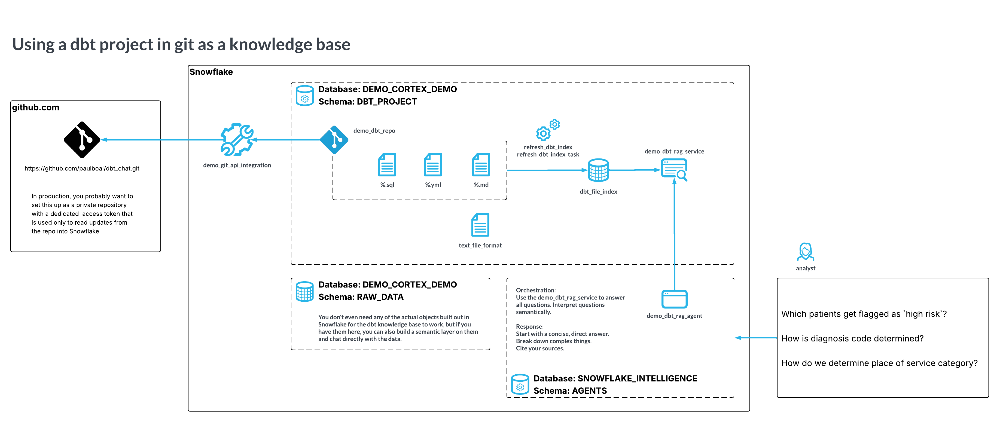

# dbt Chat Demo

You've spent all this time creating dbt models with great documentation and test cases. Everything anyone would ever need to know about how data is being interpreted and metrics are being calculated is somewhere in these dbt model files... but who has time to go digging around to find the rules and answer business user questions like "how is encounter type determined?" or "which source fields are used in which order to set patient birth date?"

Snowflake Intelligence has the time to do all that!

## Demo Walk Through

[Click to watch a walkthrough Zoom recording](https://snowflake.zoom.us/rec/share/EZ6uUU34icNvb2w_Ydn4uG9yQVbnl2L9IUbetf4Uw2K4sy2NyZQ4UoyivcoYZ0tK.wlhPTMhlvlNEHt6S?startTime=1763739811000) | Email me for the passcode.

## Architecture Overview
Components of this demo include a GitHub-hosted dbt project, Snowflake data platform, Cortex Search Service, and Cortex Agent interacting to power the dbt Chat demo.

Key components:
- GitHub repo containing dbt models, tests, and docs
- Snowflake schema with git integration and dbt files automatically ingested into a table
- Cortex Search Service indexing the dbt artifacts
- Cortex Agent answering user queries using Cortex Search

[Original image source file.](https://lucid.app/lucidchart/432d19f9-0015-4c65-9a60-2344cc089d37/edit?viewport_loc=1224%2C-1929%2C2980%2C1540%2C0_0&invitationId=inv_fbadd4f5-b1a4-482a-a78c-776467058e30)

## Prerequisites

* Have a public github repository repository with a dbt project in it, similar to [this one](https://github.com/paulboal/dbt_demo)

## Setup
1. [Database and Schema skeleton](01_skeleton.sql)
2. [Git repo integration](02_git.sql) 
3. [Cortex Search service setup](03_cortex.sql)
4. [Cortex Agent](04_agent.sql)
5. [Maintenance Scripts](05_maintenance.sql)

